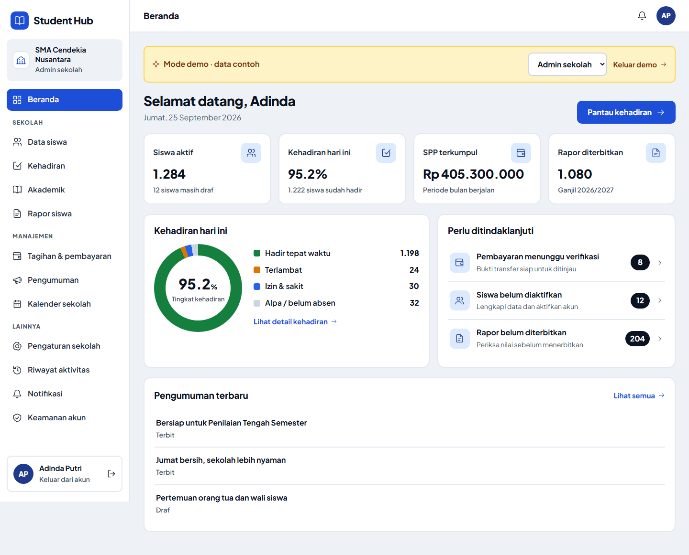

# Screenshot frontend

Semua screenshot menggunakan **mode demo**. Gambar diambil langsung dari browser, bukan mockup.

| Tampilan | Screenshot |
|---|---|
| Login desktop | [Buka](01-login-desktop.png) |
| Dashboard desktop | [Buka](02-dashboard-desktop.png) |
| Data siswa | [Buka](03-siswa-desktop.png) |
| Formulir siswa | [Buka](04-formulir-siswa-desktop.png) |
| Pengumuman | [Buka](05-pengumuman-desktop.png) |
| Kalender | [Buka](06-kalender-desktop.png) |
| Kampanye sponsor | [Buka](07-sponsor-desktop.png) |
| Dashboard mobile | [Buka](08-dashboard-mobile.png) |
| Formulir mobile | [Buka](09-formulir-mobile.png) |
| Beranda siswa (HP) | [Buka](10-beranda-siswa-mobile.png) |
| Izin lokasi & kamera sebelum absen (HP) | [Buka](11-izin-absensi-mobile.png) |
| Login + tombol demo per peran (HP) | [Buka](12-login-demo-mobile.png) |

Screenshot 10–12 diambil manual dengan emulasi HP (Pixel 7). Untuk mengambil ulang 01–09, jalankan server dengan `pnpm dev`, lalu:

```bash
node scripts/frontend-screenshots.mjs
```


